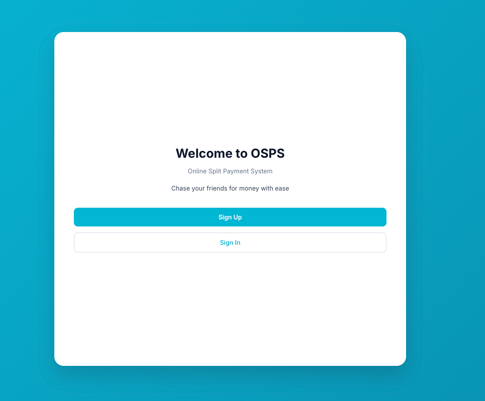
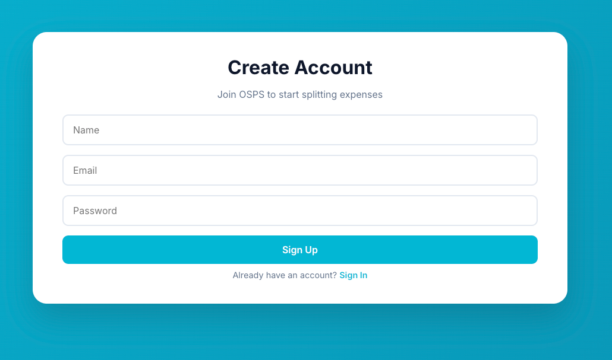
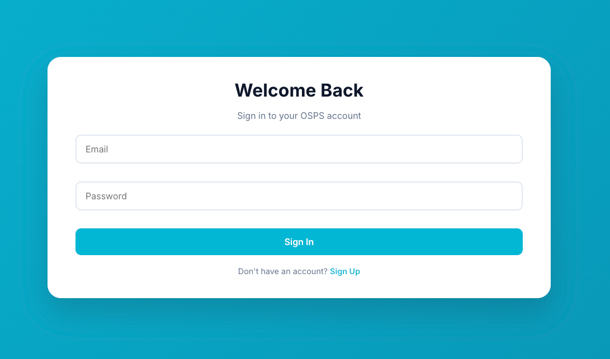
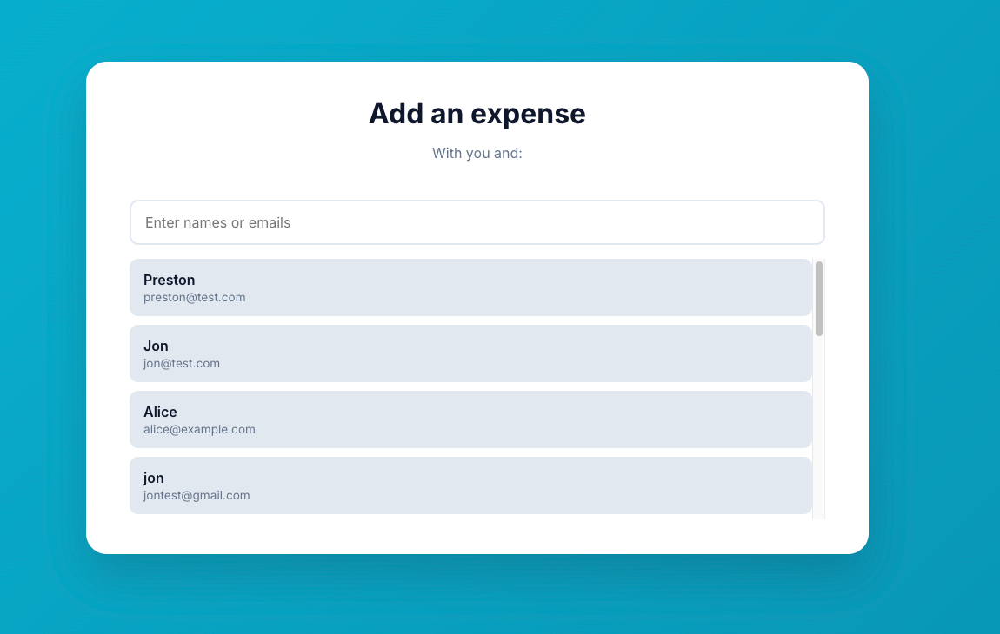
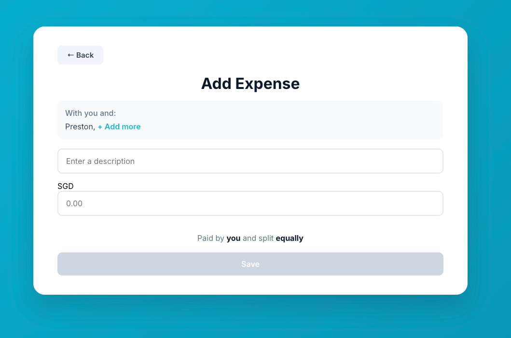
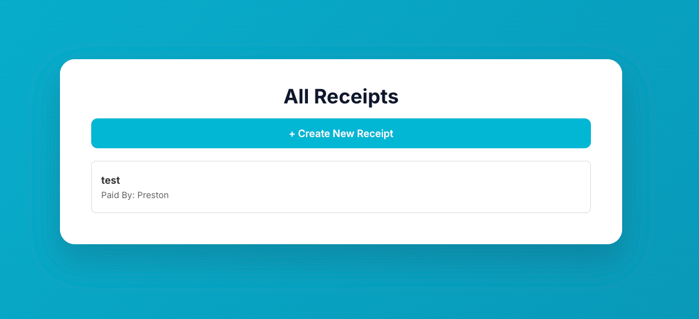
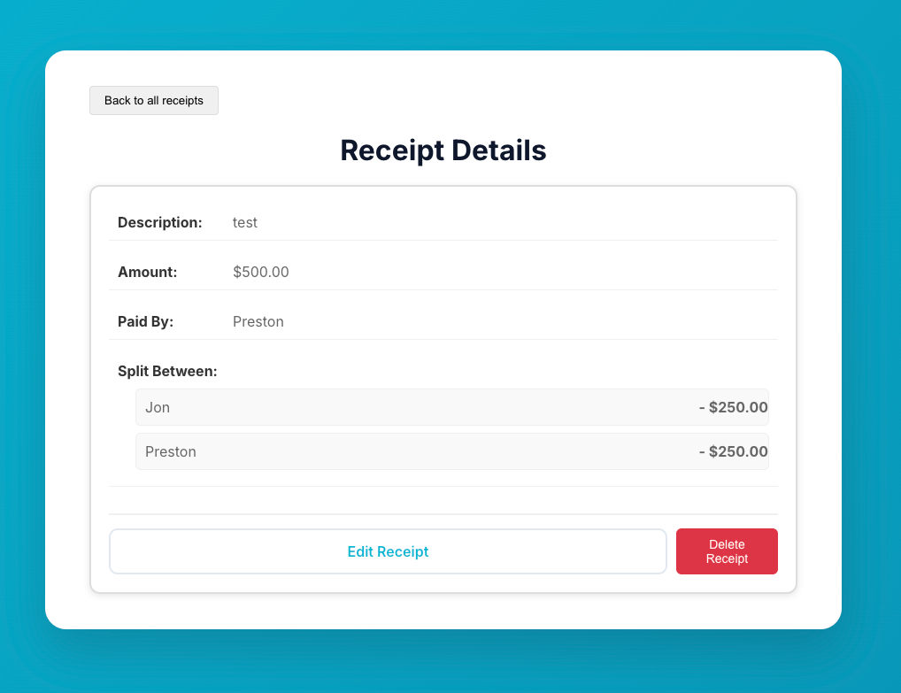
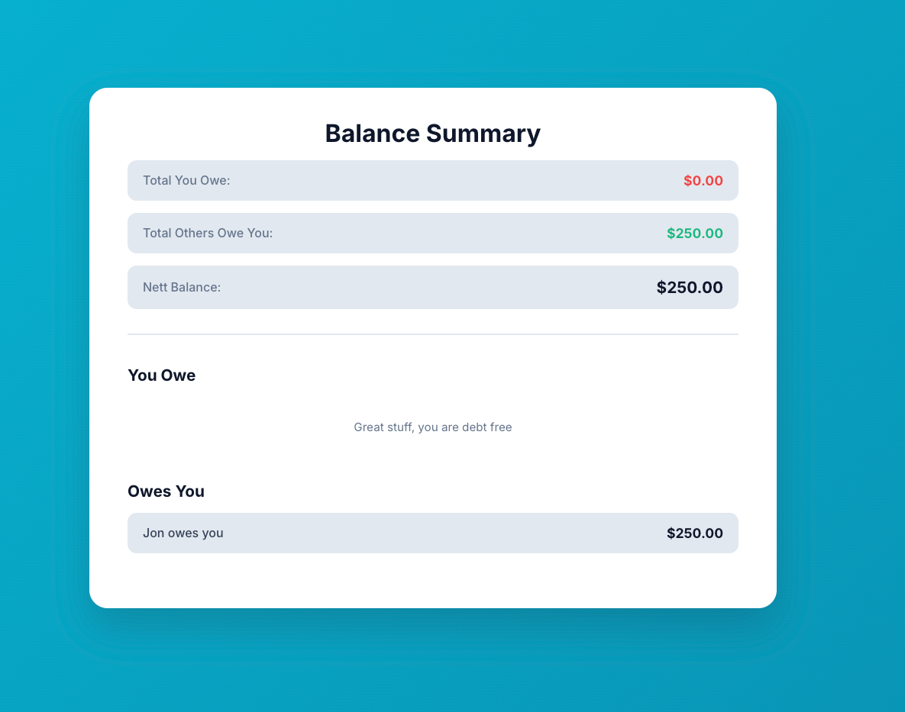

# OSPS - Online Split Payment System
**Chase your friends for money with ease**

OSPS is a web application that helps friends split expenses and track who owes money. Feature of the app are found below 

## Screenshots

### Welcome page - Sign up and sign in options

### Sign Up - Create a new account

### Sign In - Log into your account 

### Add Expense - Select friends to add expense

### Features in Add Expense - Add in details of receipt and amount

### All Receipts - View all your created receipts

### Receipt Details - View all your created receipts

#### Balance Summary - Overall balance, who you owe and who owes you

### Tech stacks
- MERN Stack - MongoDB, Express, React, Node.js

## Deployment
- Frontend: Vercel
- Backend: Render
- Database: MongoDB 

## API Endpoints
## Auth Routes
- `POST /auth/signup` - Create New User
- `POST /auth/signin` - Log into account

## Receipt Routes
- `POST /receipts` - Create new receipt
- `GET /receipts` - Get all my receipts
- `GET /receipts/:id` - Get a single receipt
- `PUT /receipts/:id` - Update receipt
- `DELETE /receipts/:id` - Delete Receipt
- `GET /receipts/balance` - Get balance summary

## Users
- `GET /users` - Get all users when creating receipt

## Future Roadmap/Improvements
- Allow users to split expense equally 
- Allow users to add in different items with description in a single receipt
- Have a group function to allow you to add friends which also categorise all receipts into one group
- Send automatic notifications is a user owes money
- Add in currency conversion features
